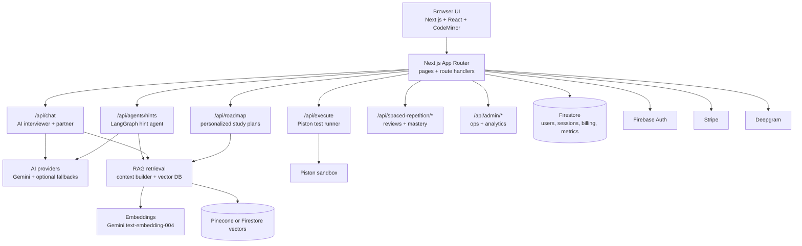
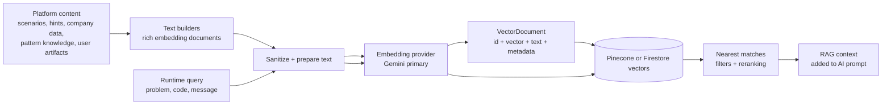

<p align="center">
  
</p>

<h1 align="center">CodeSparring</h1>

<p align="center">
  <strong>AI-Powered Coding Interview Practice Platform</strong>
</p>

<p align="center">
  <a href="https://codesparring.com">Live Demo</a> •
  <a href="#quick-start">Quick Start</a> •
  <a href="docs/API.md">API Docs</a> •
  <a href="docs/ARCHITECTURE.md">Architecture</a>
</p>

<p align="center">
  
  
  
  
</p>

---

## What is CodeSparring?

CodeSparring helps developers prepare for technical interviews by simulating realistic coding interviews with an AI interviewer. Practice in your browser with executable tests, contextual AI hints, RAG-backed interview guidance, spaced repetition, personalized roadmaps, and voice mode.

### Key Features

| Feature | Description |
|---------|-------------|
| **AI Interviewer** | Phase-aware interviewer chat with RAG context, tool-result state injection, validation, and company-aware prompts |
| **Adaptive Hint Agent** | LangGraph hint workflow with LLM diagnosis that chooses conceptual, approach, implementation, optimization, or debugging focus |
| **Code Execution** | Write and run code in multiple languages with Piston-backed test validation and structured console capture |
| **RAG Memory** | Pinecone or Firestore vector retrieval over problems, hints, knowledge, company data, and user learning history |
| **Spaced Repetition** | FSRS/SM-2 scheduling, mastery scoring, due reviews, and learning-state analytics |
| **Voice Mode** | Talk through your solution like a real interview with Deepgram-backed speech input |
| **Smart Recommendations** | Personalized next-problem recommendations based on readiness, weaknesses, and session goals |
| **Study Roadmaps** | Personalized learning paths for target companies and interview timelines |

---

## Tech Stack

| Category | Technologies |
|----------|-------------|
| **Frontend** | Next.js 16, React 19, TypeScript, Tailwind CSS 4 |
| **UI Components** | shadcn/ui, Radix UI, Framer Motion |
| **State Management** | Zustand |
| **Code Editor** | CodeMirror 6 |
| **Database** | Firebase Firestore |
| **Authentication** | Firebase Auth (GitHub/Google OAuth) |
| **AI** | Google Gemini 2.5 Flash, Gemini Flash-Lite, optional DeepSeek/Claude fallbacks |
| **Embeddings** | Gemini `text-embedding-004`, optional OpenAI/TF-IDF fallback |
| **Vector Search** | Pinecone when configured, Firestore fallback |
| **Payments** | Stripe |
| **Voice** | Deepgram |
| **Deployment** | Vercel |

---

## Quick Start

### Prerequisites

- Node.js 18+
- pnpm (recommended) or npm
- Firebase project
- Gemini API key

### Installation

```bash
# Clone the repository
git clone https://github.com/Nikayel/MockmateWebsite.git
cd MockmateWebsite

# Install dependencies
pnpm install

# Set up environment variables
cp .env.example .env.local
# Edit .env.local with your credentials

# Start development server
pnpm dev
```

Visit http://localhost:3000

### Environment Variables

```env
# Required
NEXT_PUBLIC_FIREBASE_API_KEY=your_api_key
NEXT_PUBLIC_FIREBASE_AUTH_DOMAIN=your_project.firebaseapp.com
NEXT_PUBLIC_FIREBASE_PROJECT_ID=your_project_id
GEMINI_API_KEY=your_gemini_key

# Optional (for payments)
STRIPE_SECRET_KEY=sk_test_...
STRIPE_WEBHOOK_SECRET=whsec_...
```

See `.env.example` for full configuration.

---

## Project Structure

```
MockmateWebsite/
├── app/                      # Next.js App Router
│   ├── api/                  # API routes (80+ endpoints)
│   ├── dashboard/            # User dashboard
│   ├── interview/            # Interview interface
│   ├── practice/             # Practice mode
│   └── admin/                # Admin panel
├── components/               # React components
│   ├── ui/                   # shadcn/ui primitives
│   ├── interview/            # Interview components
│   ├── dashboard/            # Dashboard components
│   └── ...
├── lib/                      # Core logic
│   ├── agents/               # Hint and recommendation agents
│   ├── interview/            # Interview prompts, phases, policies, tools
│   ├── rag/                  # RAG, embeddings, retrieval, vector DB
│   ├── spaced-repetition/    # Learning algorithms
│   ├── stores/               # Zustand stores
│   └── types.ts              # TypeScript types
├── docs/                     # Documentation
│   ├── API.md                # API reference
│   ├── ARCHITECTURE.md       # System design
│   ├── ONBOARDING.md         # New engineer guide
│   └── ...
└── public/                   # Static assets
```


---

## See It In Action

<p align="center">
  
</p>

<p align="center">
  <em>Real-time AI interviewing with code execution, hints, and instant feedback</em>
</p>

<details>
  <summary>More Screenshots</summary>

### Performance Dashboard
<p align="center">
  
</p>
<p align="center">
  <em>Track your progress with spaced repetition and detailed analytics</em>
</p>

### Problem Selection
<p align="center">
  
</p>
<p align="center">
  <em>Choose from problems organized by pattern</em>
</p>

</details>

---

## Documentation

| Document | Description |
|----------|-------------|
| [Architecture](docs/ARCHITECTURE.md) | System design & data flow |
| [Platform Architecture (Quick)](docs/PLATFORM-ARCHITECTURE.md) | High-level architecture and runtime flows |
| [Backend](docs/BACKEND.md) | API domains, integrations, request lifecycle |
| [PRD](docs/PRD.md) | Product vision, requirements, success metrics |
| [Mermaid architecture](docs/PLATFORM-ARCHITECTURE-MERMAID.md) | Supplemental copy-paste diagrams; primary diagrams are inline below |
| [API Reference](docs/API.md) | Complete API documentation |
| [Onboarding Guide](docs/ONBOARDING.md) | New engineer setup |
| [Firebase Structure](docs/FIREBASE_STRUCTURE.md) | Database schema |
| [Testing Guide](docs/TESTING_GUIDE.md) | How to write tests |
| [Contributing](CONTRIBUTING.md) | Contribution guidelines |
| [Security](SECURITY.md) | Security policy |

---

## Development

### Available Scripts

```bash
pnpm dev          # Start dev server (Turbopack)
pnpm build        # Production build
pnpm start        # Start production server
pnpm test         # Run tests
pnpm test:watch   # Tests in watch mode
pnpm test:coverage # Tests with coverage
pnpm lint         # Check code style
pnpm lint:fix     # Fix linting issues
pnpm typecheck    # TypeScript check
pnpm format       # Format code (Prettier)
```

### Code Quality

```bash
# Before committing
pnpm lint && pnpm typecheck && pnpm test
```

---

## Architecture Overview



The primary architecture diagrams live in this README so the repo front page stays useful. See [Architecture Documentation](docs/ARCHITECTURE.md) for deeper route trees, data flows, and implementation notes.

### Hint Agent Flow

```mermaid
flowchart LR
  Start([START]) --> Prepare[prepareState\nstruggle + reveal level]
  Prepare --> Diagnose[diagnoseHintNeed\nLLM classifies intent]
  Diagnose --> LLM[generateLlmHints\nwrite targeted hints]
  LLM --> Pattern[addPatternHints\nif diagnosis allows]
  Pattern --> Fallback[ensureAtLeastOneHint]
  Fallback --> RAGHint[addRagHint\nif diagnosis allows]
  RAGHint --> History[addUserHistoryHints\nif diagnosis allows]
  History --> Tests[addTestFailureHints\nif diagnosis allows]
  Tests --> Finalize[finalizeHints\nsort, dedupe, cap]
  Finalize --> End([END])
```



The hint agent is intentionally constrained: the LLM diagnoses the kind of help needed, while TypeScript code controls the allowed graph nodes, validation, fallback behavior, and final response shape.

### RAG Data Processing



Pinecone is the scaled vector store when configured; Firestore is the fallback. The important shape is the same either way: product data becomes embedding text, embedding text becomes vectors, and runtime user context retrieves nearby knowledge for the interviewer, hint agent, roadmaps, and feedback.

---

## API Highlights

### Interview Chat

```typescript
POST /api/chat
{
  "message": "How should I approach this?",
  "code": "function twoSum(nums, target) { }",
  "scenarioTitle": "Two Sum",
  "language": "javascript",
  "roleType": "interviewer"
}
```

### Code Execution

```typescript
POST /api/execute
{
  "code": "function twoSum(...) { ... }",
  "language": "javascript",
  "scenarioId": "two-sum"
}
```

See [API Documentation](docs/API.md) for all endpoints.

---

## Engineering Domains

The codebase is organized into clear ownership areas:

| Domain | Description | Key Files |
|--------|-------------|-----------|
| **Interview Engine** | Core interview experience | `components/interview/`, `app/api/chat/` |
| **Learning System** | Spaced repetition & roadmaps | `lib/spaced-repetition/`, `components/roadmap/` |
| **AI/RAG Platform** | LLM orchestration, agents, embeddings, retrieval | `lib/ai-providers.ts`, `lib/agents/`, `lib/rag/` |
| **User Dashboard** | Metrics & progress | `components/dashboard/`, `components/practice/` |
| **Platform & Infra** | Auth, billing, admin | `lib/admin/`, `app/api/webhook/` |
| **Growth** | Notifications & engagement | `lib/email/`, `app/api/cron/` |

---

## Contributing

We welcome contributions! Please see [CONTRIBUTING.md](CONTRIBUTING.md) for guidelines.

### Quick Contribution Guide

1. Fork the repository
2. Create a feature branch (`git checkout -b feature/amazing`)
3. Make your changes
4. Run tests (`pnpm test`)
5. Commit (`git commit -m 'feat: add amazing feature'`)
6. Push and create a Pull Request

---

## Security

See [SECURITY.md](SECURITY.md) for security policies and vulnerability reporting.

---

## License

Proprietary - All rights reserved.

---

## Support

- **Issues:** [GitHub Issues](https://github.com/Nikayel/MockmateWebsite/issues)
- **Email:** support@codesparring.com
- **Twitter:** [@codesparring](https://twitter.com/codesparring)

---

<p align="center">
  <strong>Built with ☕ and determination</strong>
</p>

<p align="center">
  <a href="https://codesparring.com">Website</a> •
  <a href="https://codesparring.com/blog">Blog</a> •
  <a href="https://codesparring.com/pricing">Pricing</a>
</p>
