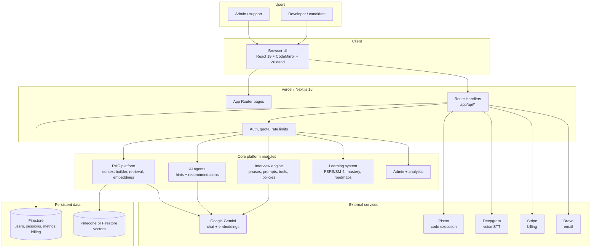
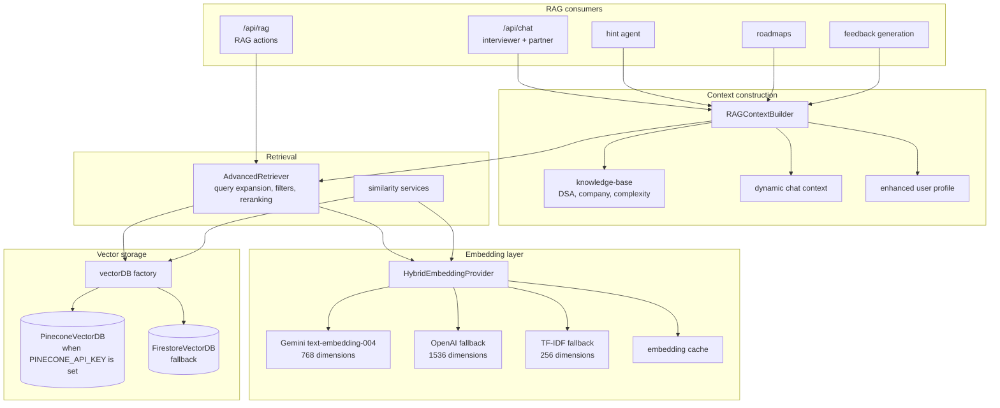
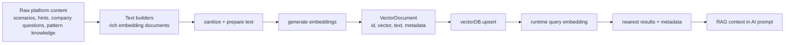
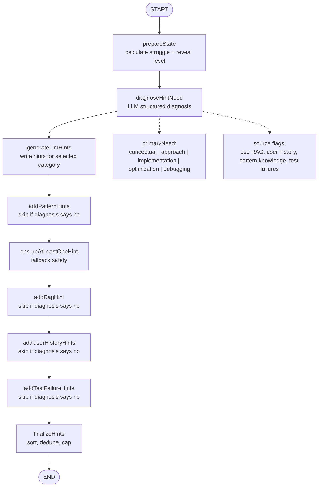

# CodeSparring Architecture

Technical architecture overview for the CodeSparring platform.

**Related documentation**

- [Backend (API domains & services)](./BACKEND.md)
- [Product requirements (PRD)](./PRD.md)
- [API reference](./API.md)
- [Firestore structure](./FIREBASE_STRUCTURE.md)
- [Mermaid diagrams (copy-paste)](./PLATFORM-ARCHITECTURE-MERMAID.md)

## System Overview



## Tech Stack

| Layer | Technology | Version | Purpose |
|-------|------------|---------|---------|
| **Framework** | Next.js | 16 | Full-stack React framework |
| **Language** | TypeScript | 5.x | Type-safe development |
| **UI** | React | 19 | Component library |
| **Styling** | Tailwind CSS | 4.x | Utility-first CSS |
| **Components** | shadcn/ui + Radix | Latest | Accessible UI components |
| **State** | Zustand | 5.x | Client state management |
| **Database** | Firebase Firestore | - | NoSQL document database |
| **Auth** | Firebase Auth | - | OAuth 2.0 authentication |
| **AI** | Google Gemini, optional DeepSeek/Claude | 2.5 Flash / Flash-Lite | Chat, hints, feedback |
| **Embeddings** | Gemini / OpenAI / TF-IDF | `text-embedding-004` primary | RAG vectors |
| **Vectors** | Pinecone / Firestore | - | RAG vector storage and semantic search |
| **Payments** | Stripe | - | Subscription billing |
| **Code Exec** | Piston | - | Sandboxed execution |
| **Voice** | Deepgram | - | Speech-to-text |
| **Email** | Brevo | - | Transactional email |
| **Hosting** | Vercel | - | Edge deployment |

---

## Directory Structure

```
MockmateWebsite/
├── app/                      # Next.js App Router
│   ├── api/                  # API routes (~86 route.ts files)
│   │   ├── chat/             # AI interview chat
│   │   ├── execute/          # Code execution
│   │   ├── admin/            # Admin endpoints
│   │   ├── spaced-repetition/# Learning system
│   │   ├── rag/              # RAG endpoints
│   │   ├── user/             # User management
│   │   ├── webhook/          # Stripe webhooks
│   │   └── cron/             # Scheduled jobs
│   ├── (pages)/              # App pages
│   │   ├── dashboard/        # User dashboard
│   │   ├── interview/        # Interview interface
│   │   ├── practice/         # Practice mode
│   │   ├── roadmap/          # Study roadmap
│   │   └── admin/            # Admin panel
│   └── layout.tsx            # Root layout
│
├── components/               # React components
│   ├── ui/                   # shadcn/ui primitives
│   ├── interview/            # Interview components
│   ├── dashboard/            # Dashboard components
│   ├── practice/             # Practice components
│   ├── roadmap/              # Roadmap components
│   ├── admin/                # Admin components
│   └── providers/            # Context providers
│
├── lib/                      # Core logic & utilities
│   ├── rag/                  # RAG system
│   │   ├── embeddings/       # Embedding providers
│   │   ├── retrieval/        # Search & ranking
│   │   ├── vectordb/         # Vector storage
│   │   └── knowledge-base/   # Domain knowledge
│   ├── spaced-repetition/    # Learning algorithms
│   │   ├── fsrs-algorithm.ts # FSRS scheduler
│   │   ├── sm2-algorithm.ts  # SM-2 scheduler
│   │   └── mastery-calculator.ts
│   ├── agents/               # AI agents
│   │   ├── hints/            # LangGraph hint agent + diagnosis
│   │   └── recommendations/  # Recommendation scoring agent
│   ├── admin/                # Admin utilities
│   │   ├── rbac.ts           # Role-based access
│   │   ├── middleware.ts     # Admin auth
│   │   └── cache.ts          # Response caching
│   ├── services/             # Business logic
│   ├── hooks/                # React hooks
│   ├── stores/               # Zustand stores
│   ├── types.ts              # TypeScript types
│   └── validations/          # Zod schemas
│
├── docs/                     # Documentation
├── public/                   # Static assets
└── content/                  # MDX blog content
```

---

## Complete HTTP API tree (`app/api`)

Every file is a Next.js **Route Handler** (`route.ts`). Methods vary per file (`GET`, `POST`, etc.); see [API.md](./API.md) for contracts.

```
app/api/
├── admin/
│   ├── admins/                 # Admin user / role management
│   ├── algorithm-research/     # SR algorithm research data
│   ├── analytics/              # Platform analytics
│   ├── announcements/          # In-app announcements (admin CRUD)
│   ├── audit/                  # Audit log queries
│   ├── cleanup-orphans/      # Data hygiene jobs
│   ├── cohorts/                # User cohort analysis
│   ├── cost-anomalies/         # AI cost anomaly detection
│   ├── email-diagnostics/      # Email system health
│   ├── feature-flags/          # Feature flag management
│   ├── feedback/               # Aggregated feedback / moderation
│   ├── funnel/                 # Conversion funnel metrics
│   ├── health/                 # Internal health checks
│   ├── insight-effectiveness/  # Insight quality metrics
│   ├── nps/                    # NPS responses (admin)
│   ├── payments/               # Payment records
│   ├── query-performance/      # DB/query performance
│   ├── rag-health/             # RAG / vector pipeline health
│   ├── rate-limits/            # Rate limit observability
│   ├── referrals/              # Referral program admin
│   ├── referrals/rewards/      # Referral rewards
│   ├── research/               # Research exports
│   ├── research/enhanced/      # Enhanced research datasets
│   ├── research/export/        # Data export
│   ├── research/users/         # Per-user research
│   ├── revenue/                # Revenue reporting
│   ├── scoring/                # Scoring analytics
│   ├── usage/                  # AI usage (admin)
│   └── user-profile/           # Impersonation / support profile view
├── agents/
│   ├── hints/                  # Hint agent (LLM-backed)
│   └── recommendations/        # Next-problem / learning recommendations
├── analyze-complexity/         # Problem complexity analysis (LLM)
├── announcements/              # Public announcements (read)
├── chat/                       # Main AI interviewer chat (Gemini + RAG context)
├── create-checkout/            # Stripe Checkout session
├── cron/
│   ├── email-notifications/    # Spaced repetition / engagement (Bearer CRON_SECRET)
│   └── subscription-expiry/    # Subscription lifecycle (Bearer CRON_SECRET)
├── customer-portal/             # Stripe billing portal URL
├── debug-promo-code/           # Dev/debug promo validation
├── delete-account/             # GDPR-style account deletion
├── email/welcome/              # Welcome email trigger
├── execute/                    # Run user code vs tests (Piston) — see § Code execution
├── execute/ast/                # AST-oriented execution helpers
├── feedback/
│   ├── instant/                # Quick feedback path
│   ├── persist/                # Persist feedback payload
│   ├── process/                # Process feedback job
│   ├── status/                 # Feedback job status
│   └── stream/                 # Streaming feedback
├── generate-feedback/          # Full post-session feedback generation
├── guest-session/              # Anonymous session create/extend
├── guest-session/migrate/      # Guest → authenticated migration
├── health/                     # Public liveness
├── nps/                        # Net Promoter Score submit
├── notifications/              # User notifications
├── notifications/preferences/  # Notification prefs (alias path)
├── promo-code/               # Promo code validation / apply
├── rag/                        # RAG operations (POST actions: hints, similar, store, …)
├── rag/health/                 # RAG subsystem health
├── rag/v2/                     # RAG v2 experiments / alternate pipeline
├── rate-limit-feedback/       # Client feedback on rate limits
├── referral/                   # Referral link / stats
├── roadmap/                    # Roadmap CRUD / generation
├── roadmap/progress/           # Roadmap progress updates
├── seed-vectors/               # Ops: seed vector index
├── session/metrics/            # Per-session analytics
├── spaced-repetition/
│   ├── batch-defer/            # Bulk defer due items
│   ├── complete/               # Mark review complete
│   ├── due/                    # Due cards
│   ├── mark-reviewed/          # Mark reviewed without full cycle
│   ├── recommendations/      # SR-based recommendations
│   ├── settings/               # User SR settings
│   ├── skip/                   # Skip a card
│   └── stats/                  # SR statistics
├── sync-subscription/          # Manual Stripe ↔ Firestore sync
├── test-email/                 # Dev email test
├── usage/voice/                # Voice usage accounting
├── user/
│   ├── mastered-problems/      # Mastery list
│   ├── metrics/                # User KPIs
│   ├── notification-preferences/
│   ├── profile/                # Profile CRUD
│   ├── subscription-status/    # Entitlements
│   └── usage/                  # AI usage (user-facing)
├── vectorize-problems/         # Batch vectorize problem bank
├── vectorize-session/          # Vectorize session for RAG memory
├── voice/token/                # Deepgram (or STT) client token
└── webhook/stripe/             # Stripe webhooks (signature verified)
```

**How to read this tree:** Folders map 1:1 to URL paths (e.g. `app/api/chat/route.ts` → `POST /api/chat`). Some routes expose multiple HTTP methods on one file.

**Maintenance:** After adding or removing API routes, update the tree and run `find app/api -name 'route.ts' | wc -l` so the “~86 route handlers” note in the directory structure stays accurate.

---

## Code execution and console output

### Execution service (Piston)

- **Transport:** HTTP to a **Piston**-compatible API (`PISTON_API_URL`, default public `emkc.org` Piston).
- **Isolation:** User code runs in Piston’s sandbox (no access to your env vars, host filesystem, or network).
- **Entry:** `POST /api/execute` → `lib/piston.ts` (`executeWithPiston`) → Piston `run` API.

### What happens on each run

1. **Rate limits & quota** — Same tiered limits as other heavy endpoints (`lib/rate-limiter`, `lib/quota-enforcement`).
2. **Scenario load** — Problem definition and test cases from `lib/scenarios` / scenario id.
3. **Wrapper injection** — User source is wrapped in a language-specific template (JavaScript/TypeScript/Python, etc.) that:
   - Defines helpers (e.g. `TreeNode`, `ListNode`, tree/list builders) for DSA problems.
   - **Patches `console.log` / `warn` / `error` / `info`** to append structured entries to an in-memory `_consoleLogs` array while still printing to stdout.
   - Invokes the user’s solution function (or class-based workflow for design-style problems).
   - Emits machine-readable lines: `__LOGS__:` + JSON array, then `__RESULT__:` + JSON return value.
4. **Parse** — `parseExecutionOutput` in `lib/piston.ts` scans stdout for `__LOGS__:` and `__RESULT__:` lines and returns `{ result, consoleLogs }`.
5. **Validate** — Test outputs are compared with expected values via `lib/validators` (property-based validators with legacy fallback in `app/api/execute/route.ts`).

### Console in the UI

Structured `ConsoleLog` objects (`type`: `log` | `error` | `warn` | `info`, `message`, `timestamp`) are returned to the client with the execution response so the interview UI can show a **console panel** separate from raw **stdout/stderr** and from **pass/fail** test rows.

### Line numbers in errors

Wrapper code adds many lines before user code. Constants such as `PYTHON_WRAPPER_LINE_OFFSET` / `JAVASCRIPT_WRAPPER_LINE_OFFSET` adjust reported line numbers back toward the user’s editor.

### Related route

- **`/api/execute`** — Property-based code execution and validation (see `app/api/execute/route.ts`).

---

## AI layer (LLM orchestration)

### Primary module

- **`lib/ai-providers.ts`** — Central abstraction for chat completions.

### Providers (configured in code)

| Provider | Typical use | Notes |
|----------|-------------|--------|
| **Gemini** (`gemini-2.5-flash`) | Default interview dialogue | Primary |
| **Gemini Lite** | Cheaper / shorter replies | Same API key |
| **DeepSeek** | Fallback chat | OpenAI-compatible HTTP, optional API key |
| **Claude** | Heavier reasoning / feedback | Optional `ANTHROPIC_API_KEY` |

Availability is gated by env vars (`GEMINI_API_KEY`, `DEEPSEEK_API_KEY`, `ANTHROPIC_API_KEY`).

### `generateAIResponse` pipeline

1. **Rate limit** — Per-user sliding window when `userId` is passed (`checkRateLimit`).
2. **Provider selection** — Based on `TaskComplexity` (`simple` | `standard` | `complex` | `dialogue` | `code` | `critique`) and optional `preferredProvider`.
3. **Cache** — `lib/ai-cache.ts` key/value cache to avoid repeat spend on identical prompts (skippable via `skipCache`).
4. **Call** — Google Generative AI SDK for Gemini; HTTP for OpenAI-compatible providers.
5. **Usage tracking** — `lib/usage-tracking.ts` records tokens/cost to Firestore (`usage_events`, aggregates) for billing and admin dashboards.
6. **Return** — `{ text, provider, tokensUsed, latencyMs }`.

### Where AI is invoked

| Area | Typical entry |
|------|----------------|
| Live interview | `/api/chat` → `generateAIResponse` + interview prompts (`lib/interview/`) |
| Feedback | `/api/generate-feedback`, `/api/feedback/*`, streaming routes |
| Hints | `/api/agents/hints`, hint paths inside chat |
| Complexity / analysis | `/api/analyze-complexity` |
| Roadmap / copy | `lib/roadmap/*`, prompts in `lib/prompts/` |

**Edge vs Node:** Some flows use `lib/ai-providers-edge.ts` where the runtime requires edge-safe imports; keep one mental model: **same product behavior, different bundle constraints**.

---

## RAG architecture

Retrieval-Augmented Generation (RAG) is implemented under **`lib/rag/`** and is consumed by chat, roadmap, hint agents, and `/api/rag` actions.

### Layer diagram



### Embeddings (`lib/rag/embeddings/`)

- **`HybridEmbeddingProvider`** — Modes such as `gemini-with-fallback`: try **Gemini `text-embedding-004`** (768-dim), then **TF-IDF** (or other fallbacks) if needed.
- **Caching** — `embeddingCache` reduces duplicate embedding calls.
- **Pinecone alignment** — `getRequiredEmbeddingDimension()` ensures vectors match the Pinecone index when Pinecone is enabled.

### Vector storage (`lib/rag/vectordb/`)

- **Default:** `FirestoreVectorDB` — vectors stored in Firestore when Pinecone is not configured.
- **Scaled:** `PineconeVectorDB` when `PINECONE_API_KEY` is set and `USE_PINECONE` is not `'false'`.
- **Factory:** `lib/rag/vectordb/index.ts` exports a singleton `vectorDB` and helpers `isPineconeEnabled()`, `getVectorDBProvider()`.

### Retrieval (`lib/rag/retrieval/advanced-retrieval.ts`)

- Query expansion, hybrid semantic + keyword signals, optional reranking with weights (similarity, recency, user history, etc.).
- Returns `EnhancedRetrievalResult[]` consumed by `RAGContextBuilder`.

### Orchestrator (`lib/rag/index.ts`)

Exports used across the app: `generateTextEmbedding`, `getSimilarProblems`, `getRelevantHints`, similarity search, storing solutions/sessions, recommendations, etc., all building on `vectorDB` + `HybridEmbeddingProvider`.

### Vectorization and data processing



The vectorization pipeline lives under `lib/rag/vectorization/`. It turns structured product content into rich text first, then embeds that text and stores a `VectorDocument` in Pinecone or Firestore. Runtime retrieval follows the inverse pattern: embed the user/problem query, retrieve nearby vectors, enrich or rerank the results, then feed relevant text into the prompt.

### HTTP surface

- **`POST /api/rag`** — Action-based JSON body (`action`: hints, similar problems, store solution, recommendations, …); some actions require auth (see `app/api/rag/route.ts`).
- **`/api/rag/v2`** — Alternate RAG path.

### Knowledge not in the vector index

Static and curated content in **`lib/rag/knowledge-base/`** (e.g. DSA patterns, company interview norms) is merged with retrieved chunks so the model always gets **curated priors** plus **personalized retrieval**.

---

## Agent Architecture

### Hint Agent

The hint agent is implemented under **`lib/agents/hints/`**. It uses LangGraph as a constrained workflow, not as an unconstrained autonomous agent. The newest step is `diagnoseHintNeed`, which asks an LLM to classify what the user needs before the graph generates or enriches hints.



The diagnosis response is validated with Zod and has deterministic fallback behavior. If the LLM returns malformed JSON, unsupported fields, or low confidence, the agent falls back to rules derived from trigger, code presence, and test results. This keeps the workflow adaptive without letting the model invent arbitrary actions.

### Recommendation Agent

The recommendation agent under **`lib/agents/recommendations/`** is algorithmic rather than LLM-agentic. It scores eligible problems using profile, readiness, difficulty, pattern targets, and session goals, then returns ranked recommendations and a session plan.

---

## Core Systems

### 1. Interview Engine

The core interview experience combining AI chat, code execution, and real-time feedback.

```
┌─────────────────────────────────────────────────────────┐
│                    Interview Page                        │
├───────────────────┬─────────────────┬───────────────────┤
│                   │                 │                   │
│   Chat Panel      │   Code Editor   │   Test Results    │
│                   │                 │                   │
│ ┌───────────────┐ │ ┌─────────────┐ │ ┌───────────────┐ │
│ │  Interviewer  │ │ │  CodeMirror │ │ │  Test Cases   │ │
│ │      or       │ │ │             │ │ │    Pass/Fail  │ │
│ │   Partner     │ │ │  Multi-lang │ │ │               │ │
│ │    Mode       │ │ │   Support   │ │ │  Console      │ │
│ └───────────────┘ │ └─────────────┘ │ └───────────────┘ │
│                   │                 │                   │
└───────────────────┴─────────────────┴───────────────────┘
```

**Data Flow:**
1. User writes code → `POST /api/execute` (Piston + validation; console captured — see [Code execution and console output](#code-execution-and-console-output))
2. User sends message → `POST /api/chat` with code, scenario, history; **RAG** augments prompts (see [RAG architecture](#rag-architecture)); **AI** routed via `lib/ai-providers.ts` (see [AI layer](#ai-layer-llm-orchestration))
3. AI responds with interviewer dialogue / hints
4. Test results and structured console logs returned to the client
5. Session metrics tracked (`/api/session/metrics`, analytics)

### 2. RAG System (summary)

Full pipeline (embeddings → Firestore or Pinecone → advanced retrieval → context builder → chat/RAG API) is documented in **[RAG architecture](#rag-architecture)** above. High level: retrieved chunks plus **knowledge-base** priors (DSA, company styles, misconceptions) feed Gemini prompts.

### 3. Spaced Repetition System

Science-backed learning retention using FSRS algorithm.

```
Problem Attempted
       │
       ▼
┌──────────────┐
│ Rate Quality │  0=forgot, 5=perfect
│   (0-5)      │
└──────────────┘
       │
       ▼
┌──────────────┐
│ FSRS/SM-2    │  Calculates next review date
│  Algorithm   │
└──────────────┘
       │
       ▼
┌──────────────┐
│ Schedule     │  Stored in Firestore
│ Next Review  │
└──────────────┘
```

**Mastery Calculation:**
- Correctness (40%)
- Time efficiency (20%)
- Code quality (20%)
- Communication (20%)

### 4. Authentication & Authorization

```
┌──────────────┐     ┌──────────────┐     ┌──────────────┐
│    Client    │────▶│   Firebase   │────▶│   OAuth      │
│   (Login)    │     │    Auth      │     │  (GitHub)    │
└──────────────┘     └──────────────┘     └──────────────┘
       │                    │
       │                    ▼
       │             ┌──────────────┐
       │             │  ID Token    │
       │             └──────────────┘
       │                    │
       ▼                    ▼
┌──────────────┐     ┌──────────────┐
│   Store in   │     │   API Route  │
│   Cookie     │     │   Verify     │
└──────────────┘     └──────────────┘
```

**RBAC Roles:**
| Role | Permissions |
|------|-------------|
| `super_admin` | Full access + manage admins |
| `admin` | Analytics, user management |
| `analyst` | Read-only analytics |
| `support` | User management only |

### 5. Payment System

```
User clicks "Upgrade"
       │
       ▼
┌──────────────┐     ┌──────────────┐
│   Create     │────▶│   Stripe     │
│   Checkout   │     │   Checkout   │
└──────────────┘     └──────────────┘
                            │
                            ▼
                     ┌──────────────┐
                     │   Payment    │
                     │   Success    │
                     └──────────────┘
                            │
                            ▼
┌──────────────┐     ┌──────────────┐
│   Update     │◀────│   Webhook    │
│  Firestore   │     │   Event      │
└──────────────┘     └──────────────┘
```

---

## Data Models

### User Profile (`profiles/{userId}`)

```typescript
interface Profile {
  id: string                    // Firebase Auth UID
  email: string
  full_name: string
  avatar_url?: string
  subscription_tier: 'free' | 'pro' | 'enterprise'
  subscription_status: 'active' | 'past_due' | 'canceled' | null
  stripe_customer_id?: string
  notification_preferences: {
    email_enabled: boolean
    spaced_repetition_reminders: boolean
  }
  onboarding_completed: boolean
  created_at: string
  updated_at: string
}
```

### Session (`interview_sessions/{sessionId}`)

```typescript
interface InterviewSession {
  id: string
  user_id: string
  scenario_id: string
  type: 'dsa' | 'system_design' | 'behavioral' | 'bug_fix'
  difficulty: 'easy' | 'medium' | 'hard'
  language: string
  session_state: 'in_progress' | 'completed' | 'abandoned'
  started_at: string
  completed_at?: string
  final_code?: string
  conversation_history: Message[]
  test_results?: TestResults
  performance_score?: number
  feedback?: Feedback
}
```

### Spaced Repetition (`spaced_repetition/{userId}/{problemId}`)

```typescript
interface SpacedRepetitionRecord {
  problem_id: string
  user_id: string
  mastery_score: number          // 0-100
  review_count: number
  last_reviewed_at: string
  next_review_date: string
  difficulty_rating: number      // FSRS difficulty
  stability: number              // FSRS stability
  interval_days: number
}
```

---

## API Layer

### Request Flow

```
Request
   │
   ▼
┌──────────────┐
│  Middleware  │  Admin route protection
└──────────────┘
   │
   ▼
┌──────────────┐
│ Rate Limiter │  Per-user, per-tier limits
└──────────────┘
   │
   ▼
┌──────────────┐
│    Auth      │  Firebase token verification
│  Verify      │
└──────────────┘
   │
   ▼
┌──────────────┐
│   Quota      │  Session/budget enforcement
│   Check      │
└──────────────┘
   │
   ▼
┌──────────────┐
│   Zod        │  Request body validation
│  Validate    │
└──────────────┘
   │
   ▼
┌──────────────┐
│  Business    │  Core logic
│   Logic      │
└──────────────┘
   │
   ▼
Response
```

### Rate Limiting Strategy

```typescript
// Sliding window algorithm
interface RateLimitConfig {
  free: { requestsPerMin: 10, tokensPerMin: 5000, concurrent: 2 }
  pro: { requestsPerMin: 30, tokensPerMin: 20000, concurrent: 5 }
  enterprise: { requestsPerMin: 100, tokensPerMin: 100000, concurrent: 20 }
}
```

### Quota Enforcement

```typescript
interface QuotaLimits {
  free: { sessionsPerMonth: 2, budgetUSD: 0.50 }
  pro: { sessionsPerMonth: 35, budgetUSD: 25.00 }
  enterprise: { sessionsPerMonth: Infinity, budgetUSD: 100.00 }
}
```

---

## Security

### Authentication

- Firebase Auth with OAuth (GitHub/Google)
- JWT tokens verified on every API request
- 50-minute token refresh intervals
- Cookie-based session indicator for SSR

### Authorization

- Row-level security via Firestore rules
- RBAC for admin features
- Audit logging for admin actions

### API Security

- Rate limiting (sliding window)
- Quota enforcement (sessions + budget)
- Input validation (Zod schemas)
- CORS configuration
- Webhook signature verification

### Sealed scenario content

Interview answers must never reach the browser. For bug-fix scenarios the root cause, ground
truth, scoring rubric, and reference solution live in server-only `*.server.ts` modules, never in
the client scenario objects:

- **Stdout-oracle packs**: `lib/scenarios/sealed/<pack-id>.server.ts`, loaded by
  `lib/scenarios/sealed/registry.server.ts`.
- **Legacy bug-fix bank (10 scenarios)**: `lib/scenarios/sealed/legacy/<id>.server.ts`, loaded by
  `lib/scenarios/sealed/legacy-registry.server.ts`. The client module keeps only the symptom-level
  brief and a generic process rubric.

Each sealed module is window-guarded (`if (typeof window !== "undefined") throw`) and may be
imported only by whitelisted server routes (feedback stream, admin bug-fix quality, RAG
vectorization). The `sealing.test.ts` import-graph test fails CI if any client component imports a
sealed module, or if a non-whitelisted file loads the registry.

### Headers

```typescript
// next.config.mjs
{
  'Strict-Transport-Security': 'max-age=31536000; includeSubDomains',
  'X-Frame-Options': 'SAMEORIGIN',
  'X-Content-Type-Options': 'nosniff',
  'Content-Security-Policy': '...',
  'Permissions-Policy': 'microphone=self'
}
```

---

## Deployment

### Infrastructure

- **Hosting:** Vercel (Edge Network)
- **Database:** Firebase Firestore (multi-region)
- **Functions:** Vercel Serverless (Node.js 18)
- **Domains:** codesparring.com

### Environment Variables

See `.env.example` for required configuration.

### Cron Jobs

| Job | Schedule | Purpose |
|-----|----------|---------|
| Subscription Expiry | Daily 9 AM | Check expiring subscriptions |
| Email Notifications | Daily 10 AM | Send spaced repetition reminders |

---

## Performance

### Optimizations

- Turbopack bundler (10x faster builds)
- Image optimization (AVIF/WebP)
- Dynamic imports for code splitting
- Response caching (admin endpoints)
- Embedding cache (RAG system)

### Monitoring

- Vercel Analytics (Web Vitals)
- Sentry (Error tracking) - planned
- Custom logger with PII redaction

---

## Scalability Considerations

| Concern | Current | Future |
|---------|---------|--------|
| Rate Limiting | In-memory | Redis (Upstash) |
| Vector Search | Firestore | Pinecone (scaled) |
| Code Execution | Piston API | Dedicated service |
| AI Caching | Per-request | Prompt caching |

---

**Last Updated:** April 2026
