# CodeSparring — Platform architecture (Mermaid)

Use this file in [Mermaid Live Editor](https://mermaid.live), VS Code (Mermaid extension), GitHub/GitLab markdown preview, or any Mermaid-compatible renderer.

Each section is **self-contained**: copy the fenced block only (including ` ```mermaid ` … ` ``` `).

---

## 1. System context (C4-style)

High-level actors, the Next.js app on Vercel, data stores, and external APIs.

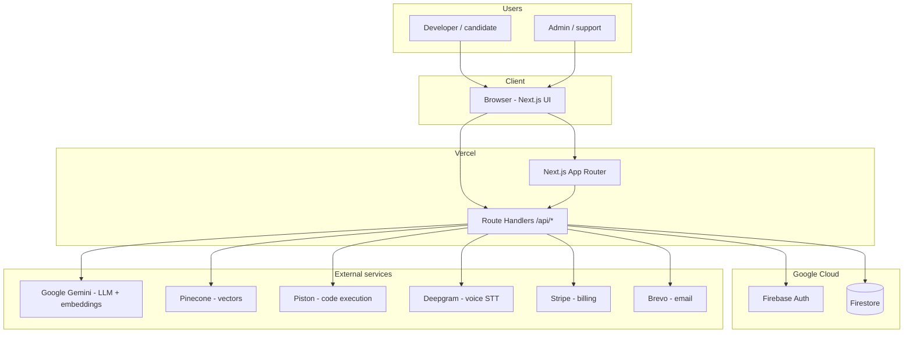

---

## 2. Interview session — behavior (sequence)

Typical flow: load scenario, run code, chat with AI, get feedback.

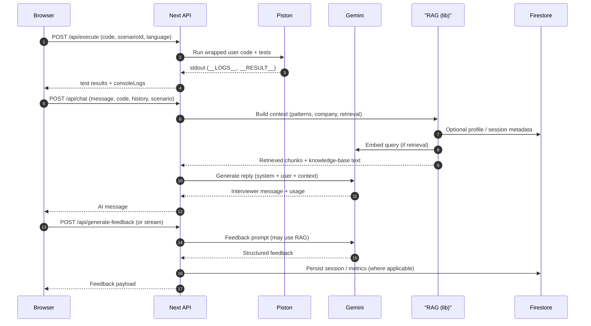

---

## 3. Code execution and console capture

Matches `lib/piston.ts`: wrapper patches console, emits markers, parses output, validates tests.

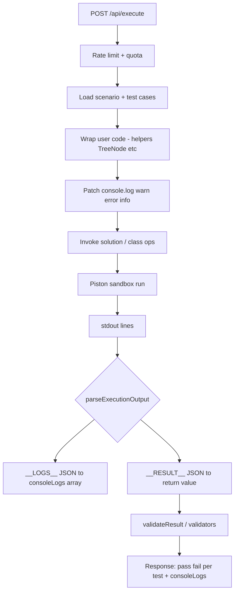

---

## 4. AI orchestration (`lib/ai-providers.ts`)

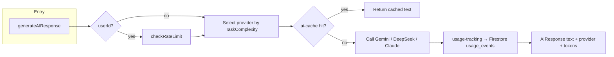

---

## 5. RAG pipeline (retrieval-augmented generation)

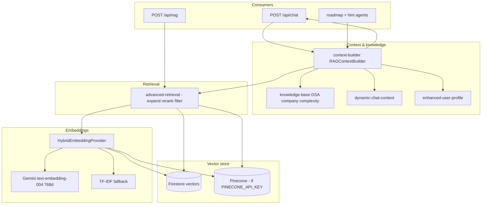

---

## 6. RAG vectorization and data processing

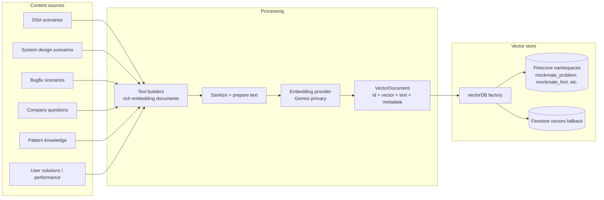

---

## 7. Hint agent LangGraph flow

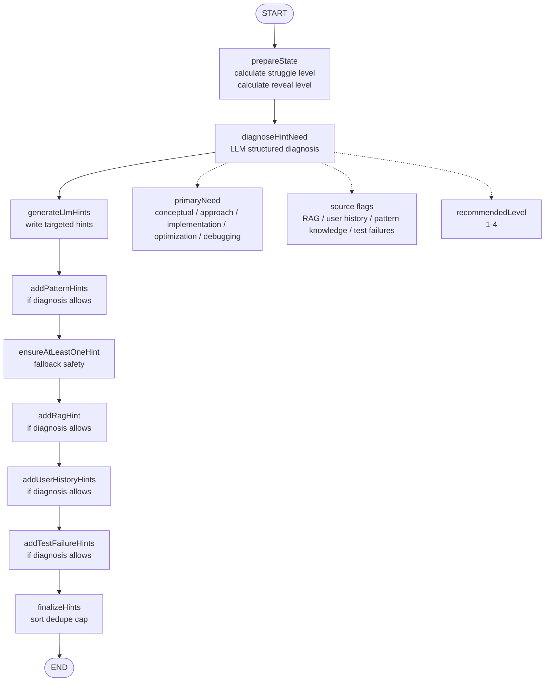

---

## 8. Authentication (API requests)

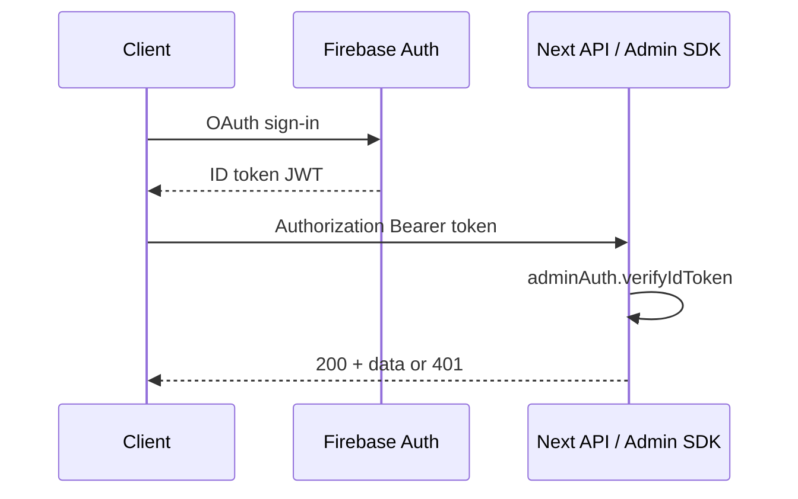

---

## 9. Stripe subscription lifecycle

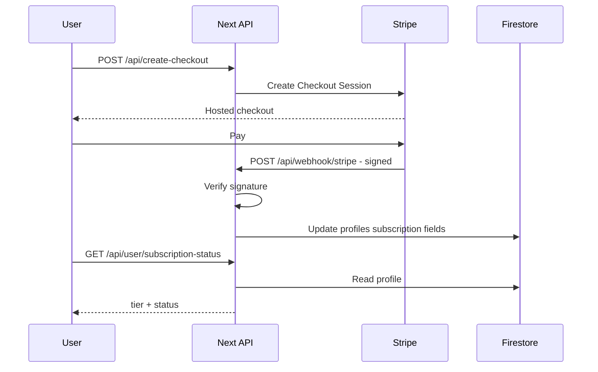

---

## 10. Cron jobs (scheduled maintenance)

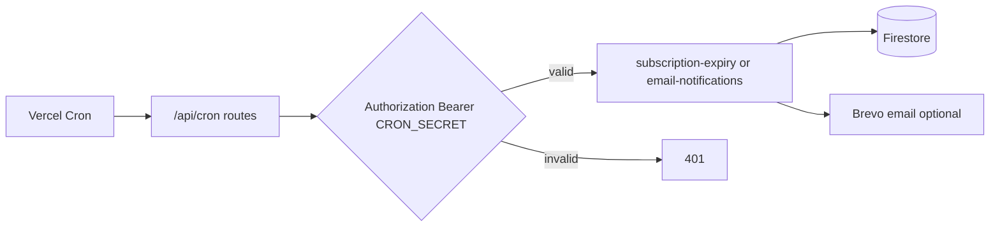

---

## 11. Admin request path (RBAC)

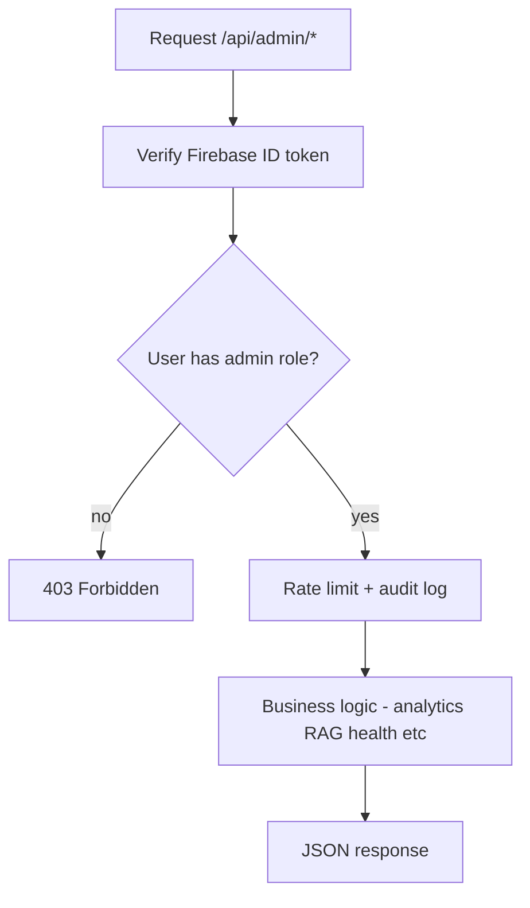

---

## 12. Data stores — conceptual (not ERD)

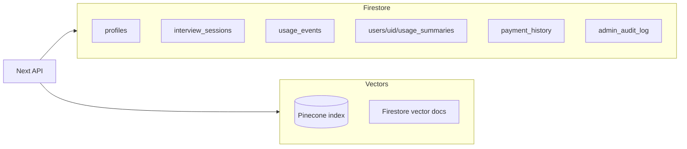

---

## Copy-paste: single combined overview (one canvas)

For a single diagram file in Mermaid Live, use this **multi-diagram** approach: Mermaid Live supports one `flowchart` or `sequenceDiagram` per render. The **System context (#1)** plus **RAG (#5)** are the two most useful “full architecture” views.

**Recommended:** paste **Section 1** and **Section 5** separately, or merge manually into one `flowchart TB` if you need one giant chart (may require simplifying subgraphs for readability).

---

**Last updated:** April 2026
