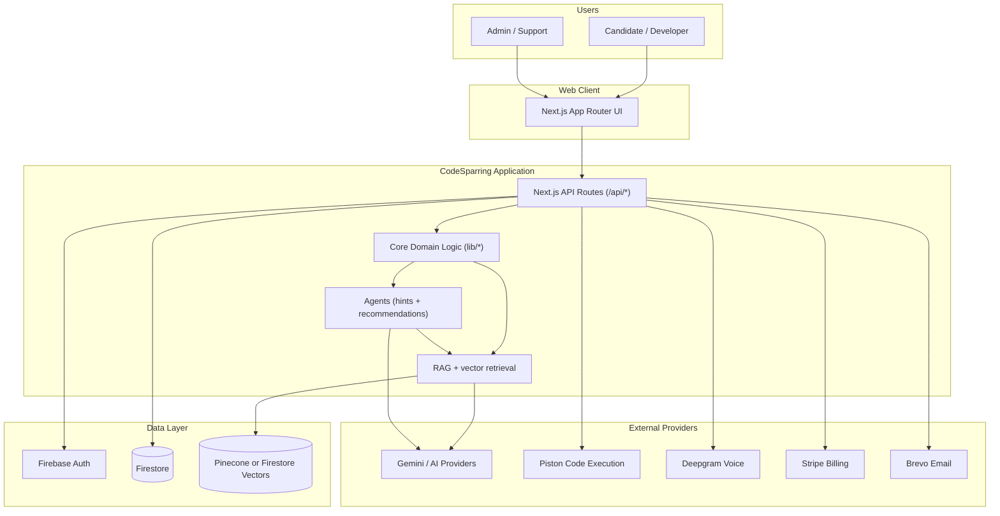
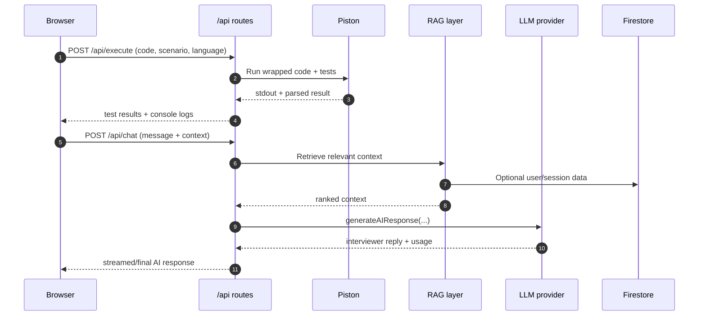
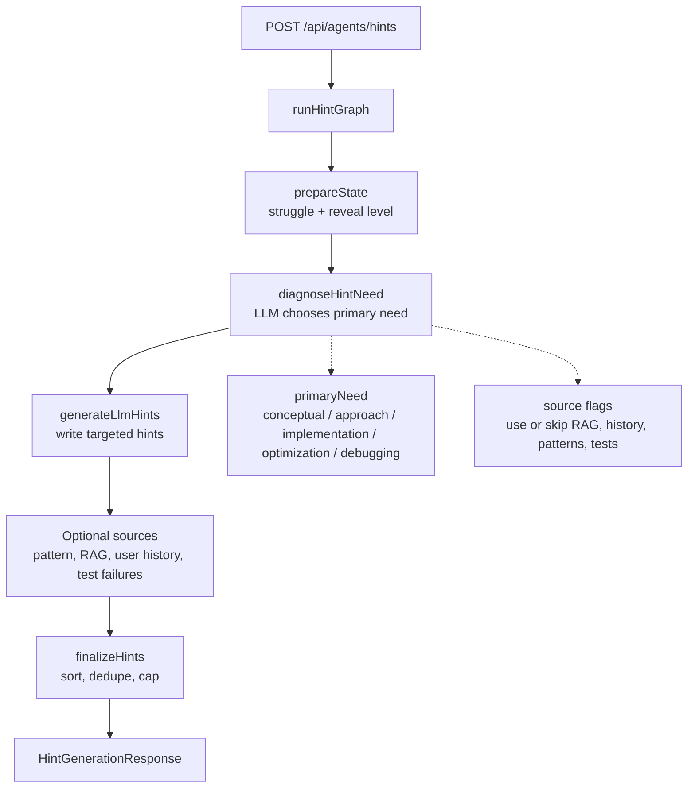
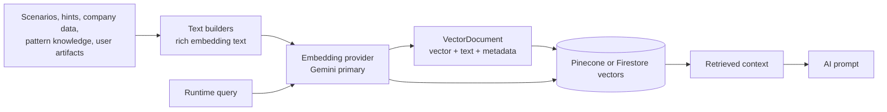

# CodeSparring Platform Architecture

High-level architecture for the CodeSparring platform, focused on how core systems interact in production.

## 1) System Context



## 2) Core Architecture Layers

1. Presentation Layer
- `app/*` pages and route segments.
- `components/*` UI, interview console, dashboard, admin views.
- The interview page (`app/interview/page.tsx`) is decomposed into single-responsibility hooks in `app/interview/_hooks/*` (session start/reset, autosave/restore/reopen, code execution, chat, phase tracking, proactive AI, metrics, feedback/streaming/system-design, timer, modes, guest quota) and presentational components in `app/interview/_components/*` (+ `_sub/*`); the page itself is the orchestrator that wires them. Pure helpers live in `app/interview/_utils/*`.
- Client state via Zustand stores in `lib/stores/*`.

2. API Layer
- `app/api/*/route.ts` route handlers for product domains:
  - Interview/chat, execution, feedback, spaced repetition, roadmap, notifications.
  - Admin analytics, health, usage, rate limits, and audit routes.

3. Domain/Service Layer
- `lib/interview/*`: interview state, prompts, session logic.
- `lib/agents/hints/*`: LangGraph hint agent with LLM diagnosis and constrained source selection.
- `lib/agents/recommendations/*`: algorithmic recommendation scoring and session plans.
- `lib/feedback/*`: transcript processing, scoring, structured feedback.
- `lib/rag/*`: retrieval, embeddings, context building, vector storage.
- `lib/spaced-repetition/*`: FSRS/SM2 scheduling and mastery tracking.
- `lib/admin/*`: RBAC, middleware, audit/cache helpers.

4. Infrastructure/Integration Layer
- Firebase (auth + data), Stripe, Brevo, Piston, Deepgram.
- AI orchestration through `lib/ai-providers.ts`.

## 3) Key Runtime Flows

### Interview Execution + AI Coaching



### Adaptive Hint Agent



The diagnosis makes the hint workflow more intentional without making it an unconstrained autonomous agent. The LLM classifies the current situation, then TypeScript code validates the output, applies fallbacks, and controls which graph nodes may contribute hints.

### RAG Data Processing



### Feedback + Learning Loop

```mermaid
flowchart LR
  A[Session Transcript + Code + Metadata] --> B[/api/generate-feedback or /api/feedback/*]
  B --> C[feedback pipeline in lib/feedback]
  C --> D[Scoring + strengths/gaps extraction]
  D --> E[Persist metrics to Firestore]
  E --> F[Spaced repetition scheduler]
  F --> G[Recommendations + due reviews in UI]
```

## 4) Data Ownership (Conceptual)

- Authentication identity: Firebase Auth token + UID.
- User profile and product state: Firestore (`users`, preferences, roadmap progress).
- Session artifacts: chat turns, execution metadata, feedback summaries.
- Learning memory: mastery metrics + spaced repetition schedule.
- Retrieval memory: vectorized content in Pinecone or Firestore vector collections.
- Agent state: hint diagnosis is returned with hint responses; recommendation scoring remains deterministic.
- Billing state: Stripe as source of truth; synchronized subscription status in Firestore.

## 5) Cross-Cutting Concerns

- AuthN/AuthZ:
  - Token verification in API routes.
  - Admin RBAC guardrails for `/api/admin/*`.
- Reliability:
  - Rate limiting and quota controls for expensive endpoints.
  - Caching for repeated AI and retrieval operations where configured.
- Observability:
  - Usage tracking, session metrics, query performance, cost anomaly monitoring.
- Security:
  - Server-side secret handling via environment variables.
  - Webhook signature verification (Stripe), cron secret checks.

## 6) Deployment Topology

- Runtime: Vercel-hosted Next.js application.
- Stateless compute: route handlers execute per-request.
- Persistent systems: Firestore, Pinecone, Stripe, Brevo.
- Scheduled jobs: Vercel cron routes for subscription and notification maintenance.

## 7) Recommended Boundaries for Future Growth

1. Keep `app/api/*` thin and move business rules to `lib/services/*` and domain modules.
2. Maintain clear contracts between:
- Interview domain (`lib/interview`)
- Feedback domain (`lib/feedback`)
- Learning domain (`lib/spaced-repetition`)
- Retrieval domain (`lib/rag`)
3. Centralize provider-specific logic behind adapters (`lib/*-providers*`) to reduce vendor lock-in.
