# CodeSparring Database Schema (ERD)

## Overview
This project uses **Firebase Firestore** (NoSQL) as its primary database. The schema is organized into client-side and admin-side collections.

## Entity Relationship Diagram

```mermaid
erDiagram
    PROFILES {
        string id PK
        string email
        string full_name
        string avatar_url
        enum subscription_tier "free|pro|enterprise"
        string subscription_platform
        string subscription_status
        string subscription_type
        string stripe_customer_id
        string stripe_subscription_id
        timestamp subscription_start_date
        timestamp subscription_current_period_end
        timestamp last_quota_reset
        timestamp created_at
        timestamp updated_at
        enum role "student|junior|mid|senior"
        enum goal "faang|startup|general|promotion"
        string target_company
        number daily_goal
        boolean onboarding_completed
        boolean tour_completed
        enum spaced_repetition_algorithm "sm2|fsrs"
    }

    PROFILE_QUOTA {
        string id PK
        string user_id FK
        number sessions_used
        number sessions_limit
        timestamp period_start
        timestamp period_end
        number free_opens_remaining
        timestamp last_session_start
        timestamp created_at
        timestamp updated_at
    }

    INTERVIEW_SESSIONS {
        string id PK
        string user_id FK
        boolean is_guest
        timestamp started_at
        timestamp completed_at
        enum difficulty "easy|medium|hard"
        string topic
        string type
        string pattern
        string scenario_id
        string target_company
        number performance_score
        number technical_score
        number mastery_score
        string feedback
        enum feedback_status "pending|complete|failed"
        string final_code
        string language
        json test_results
        number tests_passed
        number tests_total
        string time_complexity
        string space_complexity
        number efficiency_score
        json score_breakdown
        json session_state
        timestamp created_at
        timestamp updated_at
    }

    NOTIFICATION_PREFERENCES {
        string userId PK
        boolean enabled
        string timezone
        json channels
        json quietHours
        json typePreferences
        string fcmToken
        timestamp fcmTokenUpdatedAt
        timestamp createdAt
        timestamp updatedAt
    }

    NOTIFICATIONS {
        string id PK
        string userId FK
        string type
        string title
        string body
        json data
        timestamp scheduledFor
        enum priority "critical|high|medium|low"
        array channels
        enum status "pending|sent|delivered|opened|dismissed|failed|cancelled"
        json channelStatus
        timestamp openedAt
        timestamp dismissedAt
        string actionTaken
        timestamp createdAt
        timestamp updatedAt
    }

    NOTIFICATION_QUEUE {
        string id PK
        string userId FK
        string type
        json triggerData
        timestamp scheduledFor
        enum priority "critical|high|medium|low"
        number attempts
        number maxAttempts
        timestamp lastAttemptAt
        string lastError
        enum status "pending|processing|completed|failed"
        timestamp createdAt
        timestamp updatedAt
    }

    NOTIFICATION_ANALYTICS {
        string userId PK
        number totalSent
        number totalOpened
        number totalDismissed
        json byType
        number openRate
        number bestHourForEngagement
        string preferredChannel
        timestamp updatedAt
    }

    IN_APP_NOTIFICATIONS {
        string id PK
        string userId FK
        string type
        string title
        string body
        string link
        string icon
        boolean read
        timestamp createdAt
    }

    USER_LEARNING_STATE {
        string user_id PK
        json topics
        timestamp last_session_at
        number streak_days
        number daily_goal
        number max_daily_reviews
        timestamp created_at
        timestamp updated_at
    }

    PROBLEM_MASTERY {
        string problem_id PK
        string user_id FK
        string scenario_id
        string title
        string pattern
        enum difficulty "easy|medium|hard"
        number ease_factor
        number interval_days
        number review_count
        timestamp next_review_at
        number last_score
        number average_score
        number best_score
        array scores_history
        timestamp first_seen_at
        timestamp last_reviewed_at
        number time_spent_minutes
        number hints_used_total
        enum mastery_level "new|learning|reviewing|mastered"
        number confidence
    }

    USAGE_EVENTS {
        string id PK
        string userId FK
        enum eventType "chat_message|feedback_generation|code_execution|hint_request|session_start|session_end|voice_transcription|embedding_generation"
        string sessionId
        timestamp createdAt
        json metadata
        string provider
        string model
        number inputTokens
        number outputTokens
        number totalTokens
        number cost
        number latencyMs
    }

    ALGORITHM_RESEARCH_METRICS {
        string id PK
        string user_id FK
        enum algorithm "sm2|fsrs"
        string date
        number reviews_completed
        number reviews_skipped
        number total_review_time_minutes
        number average_score
        number retention_rate
        number lapse_count
        number streak_days
        timestamp created_at
        timestamp updated_at
    }

    ALGORITHM_RESEARCH_EVENTS {
        string id PK
        string user_id FK
        enum algorithm "sm2|fsrs"
        timestamp timestamp
        string problem_id
        string scenario_id
        string pattern
        enum difficulty "easy|medium|hard"
        number score
        number mastery_score
        number quality_rating
        number time_spent_minutes
        number hints_used
        json pre_review
        json post_review
        boolean actual_retention
    }

    SUBSCRIPTION_HISTORY {
        string id PK
        string user_id FK
        enum tier "free|pro|enterprise"
        enum status "active|canceled|expired|past_due|trialing"
        string subscription_type
        string platform
        string stripe_subscription_id
        timestamp started_at
        timestamp ended_at
        enum reason "upgrade|downgrade|cancellation|expiration|payment_failed|initial"
        string previous_tier
        timestamp created_at
    }

    EMAIL_LOGS {
        string id PK
        string user_id FK
        enum email_type "welcome|inactivity_reminder|spaced_repetition_reminder|milestone|subscription_expiry|payment_failed|subscription_canceled|marketing"
        string recipient_email
        string subject
        enum status "pending|sent|failed|bounced|complained"
        string provider
        string provider_message_id
        string error_message
        json metadata
        timestamp scheduled_at
        timestamp sent_at
        timestamp opened_at
        timestamp clicked_at
        timestamp created_at
        timestamp expiresAt
    }

    PROFILE_AUDIT_LOG {
        string id PK
        string user_id FK
        enum field_name "role|goal|target_company|daily_goal|onboarding_completed|subscription_tier"
        string old_value
        string new_value
        timestamp changed_at
        enum change_source "user|system|admin|stripe_webhook"
        json metadata
        timestamp created_at
    }

    %% Relationships
    PROFILES ||--o{ PROFILE_QUOTA : "has"
    PROFILES ||--o{ INTERVIEW_SESSIONS : "creates"
    PROFILES ||--|| NOTIFICATION_PREFERENCES : "has"
    PROFILES ||--o{ NOTIFICATIONS : "receives"
    PROFILES ||--o{ NOTIFICATION_QUEUE : "queued for"
    PROFILES ||--|| NOTIFICATION_ANALYTICS : "has"
    PROFILES ||--o{ IN_APP_NOTIFICATIONS : "receives"
    PROFILES ||--|| USER_LEARNING_STATE : "has"
    PROFILES ||--o{ PROBLEM_MASTERY : "tracks"
    PROFILES ||--o{ USAGE_EVENTS : "generates"
    PROFILES ||--o{ ALGORITHM_RESEARCH_METRICS : "participates in"
    PROFILES ||--o{ ALGORITHM_RESEARCH_EVENTS : "logs"
    PROFILES ||--o{ SUBSCRIPTION_HISTORY : "has history"
    PROFILES ||--o{ EMAIL_LOGS : "receives emails"
    PROFILES ||--o{ PROFILE_AUDIT_LOG : "tracks changes"
```



## Collection Details

### Core User Collections

| Collection | Purpose | Key Fields |
|------------|---------|------------|
| `profiles` | User accounts and settings | email, subscription_tier, onboarding_completed |
| `profile_quota` | Usage limits per billing period | sessions_used, sessions_limit, period_end |
| `interview_sessions` | Practice interview records | topic, difficulty, performance_score, feedback |
| `subscription_history` | Subscription tier change log | tier, status, started_at, ended_at, reason |

### Notification System

| Collection | Purpose | Key Fields |
|------------|---------|------------|
| `notification_preferences` | User notification settings | enabled, timezone, channels, quietHours |
| `notifications` | Individual notification records | type, status, scheduledFor, priority |
| `notification_queue` | Batch processing queue | status, attempts, scheduledFor |
| `notification_analytics` | Engagement metrics | openRate, totalSent, bestHourForEngagement |
| `in_app_notifications` | In-app notification center | title, body, read, link |

### Learning & Progress

| Collection | Purpose | Key Fields |
|------------|---------|------------|
| `user_learning_state` | Overall learning progress | topics, streak_days, daily_goal |
| `problem_mastery` | Per-problem spaced repetition | ease_factor, interval_days, next_review_at |

### Analytics & Research

| Collection | Purpose | Key Fields |
|------------|---------|------------|
| `usage_events` | API usage and costs | eventType, cost, inputTokens, outputTokens |
| `algorithm_research_metrics` | A/B testing (SM-2 vs FSRS) | algorithm, retention_rate, average_score |
| `algorithm_research_events` | Individual review events | score, quality_rating, actual_retention |
| `email_logs` | Email audit trail (90-day TTL) | email_type, status, sent_at, provider |
| `profile_audit_log` | Profile field change history | field_name, old_value, new_value, changed_at |

## Key Relationships

```
profiles (1) ──────────→ (many) profile_quota
        ├──────────────→ (many) interview_sessions
        ├──────────────→ (1) notification_preferences
        ├──────────────→ (many) notifications
        ├──────────────→ (many) notification_queue
        ├──────────────→ (1) notification_analytics
        ├──────────────→ (many) in_app_notifications
        ├──────────────→ (1) user_learning_state
        ├──────────────→ (many) problem_mastery
        ├──────────────→ (many) usage_events
        ├──────────────→ (many) algorithm_research_metrics
        ├──────────────→ (many) subscription_history
        ├──────────────→ (many) email_logs
        └──────────────→ (many) profile_audit_log
```

## Indexing Strategy

**Critical Composite Indexes:**

1. `profile_quota(user_id, period_end)` - Quota lookup by billing period
2. `problem_mastery(user_id, next_review_at)` - Spaced repetition scheduling
3. `usage_events(userId, createdAt)` - Usage analytics queries
4. `notifications(userId, createdAt)` - Notification history
5. `interview_sessions(user_id, created_at)` - Session history retrieval
6. `subscription_history(user_id, started_at)` - Subscription timeline queries
7. `email_logs(user_id, created_at)` - Email audit queries
8. `profile_audit_log(user_id, changed_at)` - Profile change history
9. `profile_audit_log(user_id, field_name, changed_at)` - Field-specific history

## Data Retention

See [data-retention-strategy.md](data-retention-strategy.md) for TTL policies and archival strategy.

**Collections with TTL:**
| Collection | Retention | Archival |
|------------|-----------|----------|
| `usage_events` | 30 days | BigQuery |
| `algorithm_research_events` | 90 days | BigQuery |
| `email_logs` | 90 days | BigQuery |
| `rate_limits` | 1 day | None |

## Notes

- **Database Type**: Firebase Firestore (NoSQL document database)
- **Foreign Key Pattern**: Reference by string ID (no built-in referential integrity)
- **Primary Key Strategy**: Document ID (auto-generated by Firestore)
- **Subscription Tiers**: free, pro, enterprise
- **Spaced Repetition Algorithms**: SM-2 (default), FSRS (experimental/A/B test)
