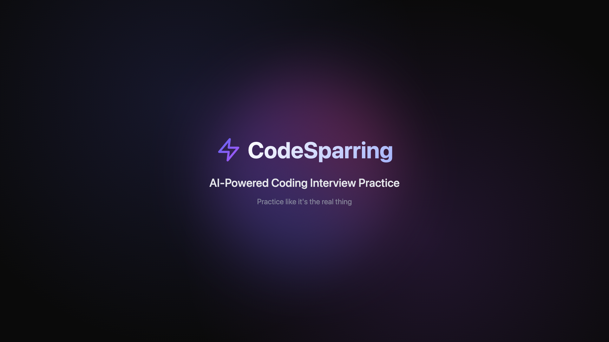
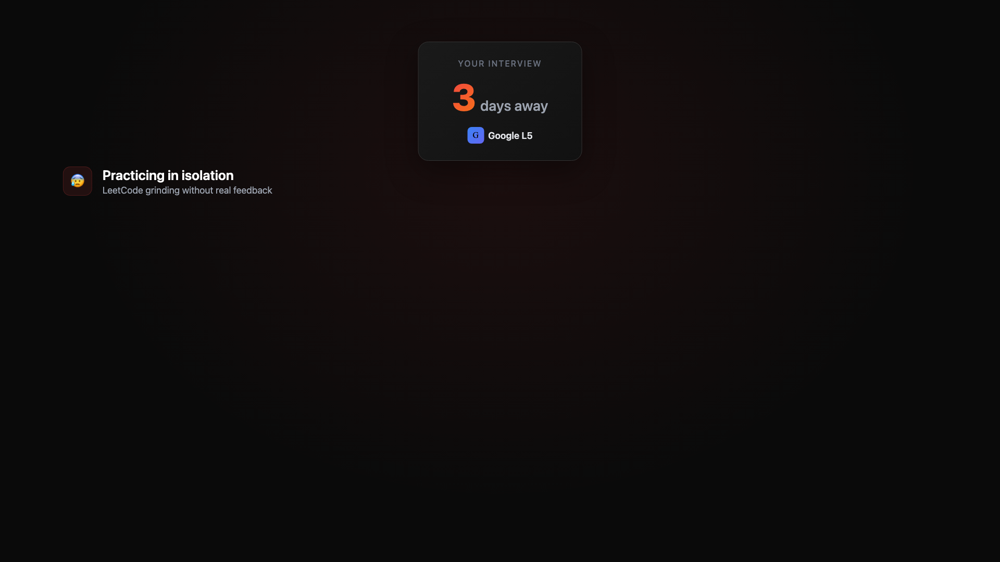
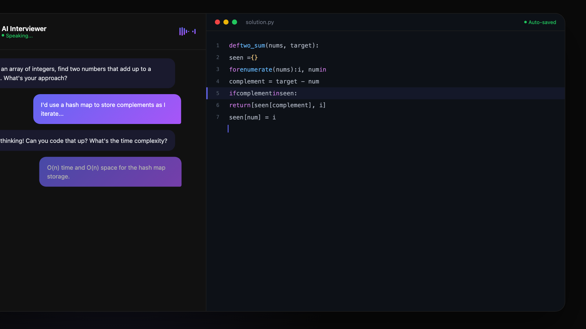
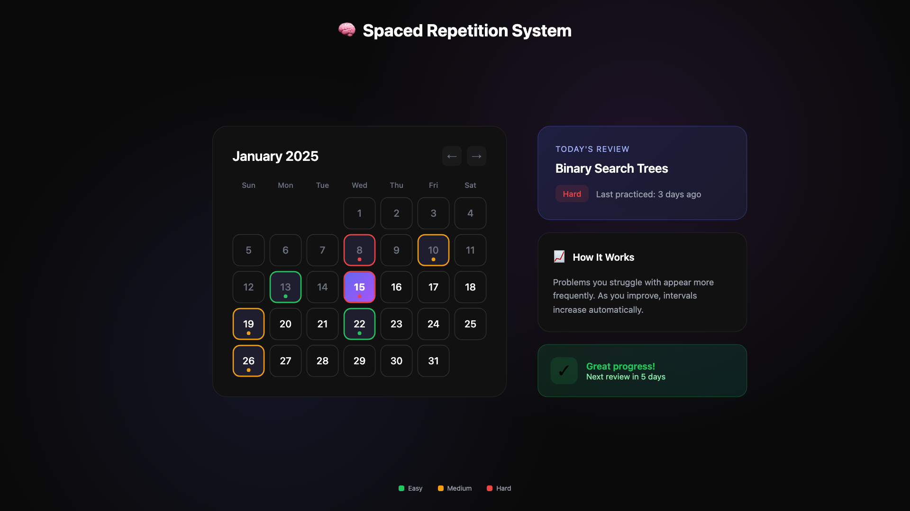
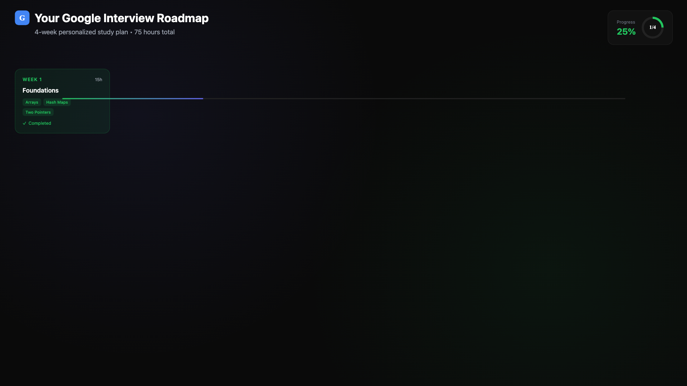
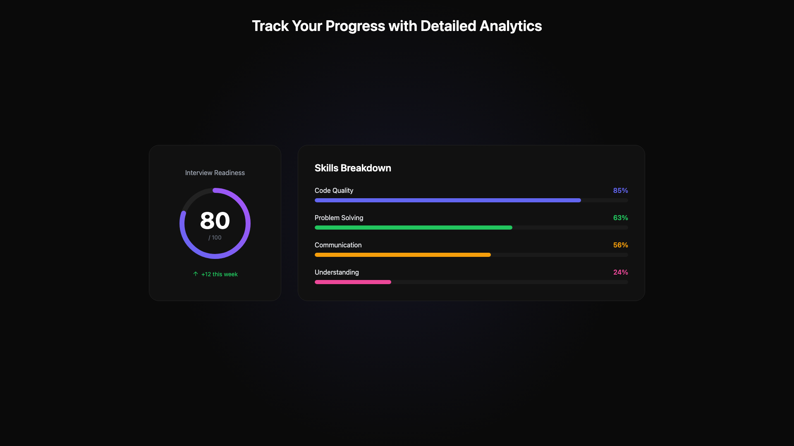
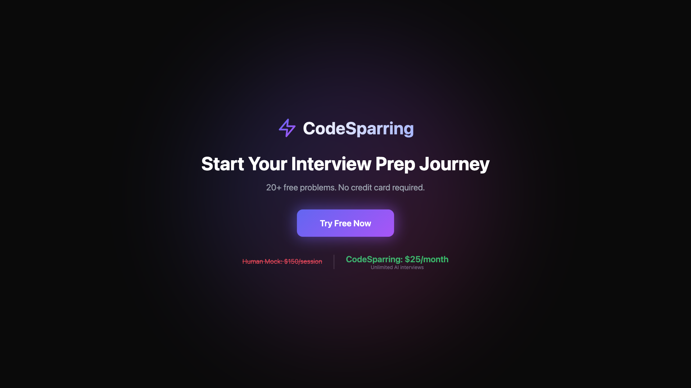

# Remotion Video System

Programmatic video generation for CodeSparring product demos using React and Remotion.

## Overview

| Property | Value |
|----------|-------|
| Duration | 45 seconds |
| FPS | 30 |
| Resolution | 1920x1080 (Full HD) |
| Total Frames | 1350 |

## Quick Start

```bash
# Preview in Remotion Studio
npm run remotion:preview

# Render to MP4
npm run remotion:render
```

Output: `out/product-demo.mp4`

---

## Video Structure

The `ProductDemo` composition consists of 7 sequential scenes:

```
┌─────────────────────────────────────────────────────────────────────────────────────┐
│ 0s          5s          9s          18s         26s         34s         39s     45s │
│ ├───────────┼───────────┼───────────┼───────────┼───────────┼───────────┼─────────┤ │
│ │  Intro    │  Problem  │    AI     │  Spaced   │  Roadmap  │ Analytics │   CTA   │ │
│ │  (5s)     │   (4s)    │Interview  │Repetition │   (8s)    │   (5s)    │  (6s)   │ │
│ │           │           │   (9s)    │   (8s)    │           │           │         │ │
│ └───────────┴───────────┴───────────┴───────────┴───────────┴───────────┴─────────┘ │
└─────────────────────────────────────────────────────────────────────────────────────┘
```

---

## Scene Details

### 1. IntroScene (0-5s)
**Purpose:** Brand introduction and hook



**Elements:**
- Animated CodeSparring logo with spring physics
- Gradient text effect
- Tagline: "AI-Powered Coding Interview Practice"
- Rotating conic gradient background orb

**Animations:**
- Logo scale: spring animation
- Tagline: fade + slide up
- Background: 360° rotation over scene duration

---

### 2. ProblemScene (5-9s)
**Purpose:** Establish pain points



**Elements:**
- Interview countdown timer (emotional hook)
- Three pain points revealed sequentially:
  1. Practicing in isolation (LeetCode grinding)
  2. Expensive mock interviews ($150-300/session)
  3. No clear study roadmap
- Transition question: "What if you had a personal AI interviewer?"

**Animations:**
- Dynamic gradient shift (red to blue)
- Staggered text reveals

---

### 3. AIInterviewerScene (9-18s)
**Purpose:** Live AI interview simulation demo



**Elements:**
- Split-screen layout (chat | code editor)
- AI interviewer avatar with "Speaking..." status
- Voice waveform visualization
- Multi-message conversation flow
- Python code editor with syntax highlighting (Two Sum)
- Real-time feedback panel (Strengths & Suggestions)

**Animations:**
- Cinematic zoom effects
- Message reveals
- Code typing with cursor
- Line highlighting
- Typing indicator dots

---

### 4. SpacedRepetitionScene (18-26s)
**Purpose:** Spaced Repetition algorithm visualization



**Elements:**
- Interactive calendar widget (January 2025)
- Color-coded difficulty levels:
  - Green: Easy
  - Orange: Medium
  - Red: Hard
- Today's practice card: "Binary Search Trees"
- "How It Works" explanation panel
- Success notification popup

**Animations:**
- Staggered calendar day reveals
- Zoom to calendar details
- Popup slide-in

---

### 5. RoadmapScene (26-34s)
**Purpose:** Personalized study roadmap generation



**Elements:**
- Phase 1: Input form (company selector, interview date)
- Phase 2: Generated 4-week study plan
  - Week cards with topics
  - Status badges (Completed, Current, Upcoming)
  - Progress circle (25%)
  - "Today's Focus" panel

**Animations:**
- Form → Roadmap transition
- Progress bar fill
- Card stagger reveals

---

### 6. AnalyticsScene (34-39s)
**Purpose:** Progress tracking and performance metrics



**Elements:**
- Interview Readiness score: 87/100
- Skills Breakdown:
  - Code Quality: 85%
  - Problem Solving: 72%
  - Communication: 90%
  - Understanding: 65%
- Trend indicator: "Up +12 this week"

**Animations:**
- SVG circular progress animation
- Progress bar fills

---

### 7. CTAScene (39-45s)
**Purpose:** Call-to-action and value proposition



**Elements:**
- CodeSparring logo
- Headline: "Start Your Interview Prep Journey"
- Subtext: "20+ free problems. No credit card required."
- CTA button with glow effect
- Price comparison:
  - ~~Human Mock: $150/session~~
  - CodeSparring: $25/month - Unlimited AI interviews

**Animations:**
- Rotating gradient background
- Button pulse/glow

---

## Generating Screenshots

To capture screenshots for documentation:

```bash
# 1. Start Remotion Studio
npm run remotion:preview

# 2. Navigate to each scene's key frame
# 3. Use browser screenshot or Remotion's still export:
npx remotion still remotion/index.tsx ProductDemo --frame=75 --output=docs/screens/01-intro.png
npx remotion still remotion/index.tsx ProductDemo --frame=210 --output=docs/screens/02-problem.png
npx remotion still remotion/index.tsx ProductDemo --frame=400 --output=docs/screens/03-ai-interview.png
npx remotion still remotion/index.tsx ProductDemo --frame=660 --output=docs/screens/04-spaced-rep.png
npx remotion still remotion/index.tsx ProductDemo --frame=900 --output=docs/screens/05-roadmap.png
npx remotion still remotion/index.tsx ProductDemo --frame=1095 --output=docs/screens/06-analytics.png
npx remotion still remotion/index.tsx ProductDemo --frame=1260 --output=docs/screens/07-cta.png
```

---

## Reusable Components

### ZoomContainer

Cinematic zoom effects with spring physics.

```tsx
import { ZoomContainer } from "./components/ZoomContainer"

<ZoomContainer
  zoomInStart={80}
  zoomInEnd={120}
  zoomOutStart={160}
  zoomOutEnd={200}
  maxScale={1.5}
  focusX={75}  // Focus point X (%)
  focusY={50}  // Focus point Y (%)
>
  <YourContent />
</ZoomContainer>
```

### PulseHighlight

Pulsing border highlight for attention.

```tsx
import { PulseHighlight } from "./components/ZoomContainer"

<PulseHighlight startFrame={100} color="#6366f1">
  <YourElement />
</PulseHighlight>
```

---

## Animation Patterns

### Spring Physics
```tsx
const scale = spring({
  frame,
  fps,
  config: { damping: 12, stiffness: 100 },
  from: 0,
  to: 1,
})
```

### Interpolation
```tsx
const opacity = interpolate(frame, [0, 30], [0, 1], {
  extrapolateRight: "clamp",
})
```

### Staggered Reveals
```tsx
const itemOpacity = interpolate(
  frame,
  [baseFrame + index * 10, baseFrame + index * 10 + 15],
  [0, 1],
  { extrapolateLeft: "clamp", extrapolateRight: "clamp" }
)
```

---

## Color Palette

| Color | Hex | Usage |
|-------|-----|-------|
| Primary | `#6366f1` | Buttons, highlights, accents |
| Secondary | `#a855f7` | Gradients, secondary elements |
| Success | `#22c55e` | Positive feedback, completed states |
| Warning | `#f59e0b` | Suggestions, medium difficulty |
| Danger | `#ef4444` | Errors, hard difficulty |
| Background | `#0a0a0a` | Main background |
| Surface | `#111111` | Cards, panels |
| Border | `#222222` | Dividers, borders |

---

## File Structure

```
remotion/
├── index.tsx                 # Root composition registry
├── ProductDemo.tsx           # Main composition (scene sequencing)
├── components/
│   └── ZoomContainer.tsx     # Reusable animation utilities
├── scenes/
│   ├── IntroScene.tsx
│   ├── ProblemScene.tsx
│   ├── AIInterviewerScene.tsx
│   ├── SpacedRepetitionScene.tsx
│   ├── RoadmapScene.tsx
│   ├── AnalyticsScene.tsx
│   └── CTAScene.tsx
└── README.md                 # This file
```

---

## Adding New Scenes

1. Create scene component in `scenes/`:
```tsx
import { AbsoluteFill, useCurrentFrame, interpolate } from "remotion"

export const NewScene: React.FC = () => {
  const frame = useCurrentFrame()

  return (
    <AbsoluteFill style={{ background: "#0a0a0a" }}>
      {/* Scene content */}
    </AbsoluteFill>
  )
}
```

2. Add to `ProductDemo.tsx`:
```tsx
import { NewScene } from "./scenes/NewScene"

// In composition:
<Sequence from={previousEndFrame} durationInFrames={yourDuration}>
  <NewScene />
</Sequence>
```

3. Update total duration in `index.tsx` if needed.

---

## Rendering Options

```bash
# Standard MP4
npm run remotion:render

# Custom quality
npx remotion render remotion/index.tsx ProductDemo out/video.mp4 --crf=18

# Different format
npx remotion render remotion/index.tsx ProductDemo out/video.webm --codec=vp8

# GIF (for previews)
npx remotion render remotion/index.tsx ProductDemo out/preview.gif --image-format=png

# Specific frame range
npx remotion render remotion/index.tsx ProductDemo out/clip.mp4 --frames=270-540
```

---

## Dependencies

```json
{
  "remotion": "^4.0.407",
  "@remotion/cli": "^4.0.407",
  "@remotion/player": "^4.0.407"
}
```
